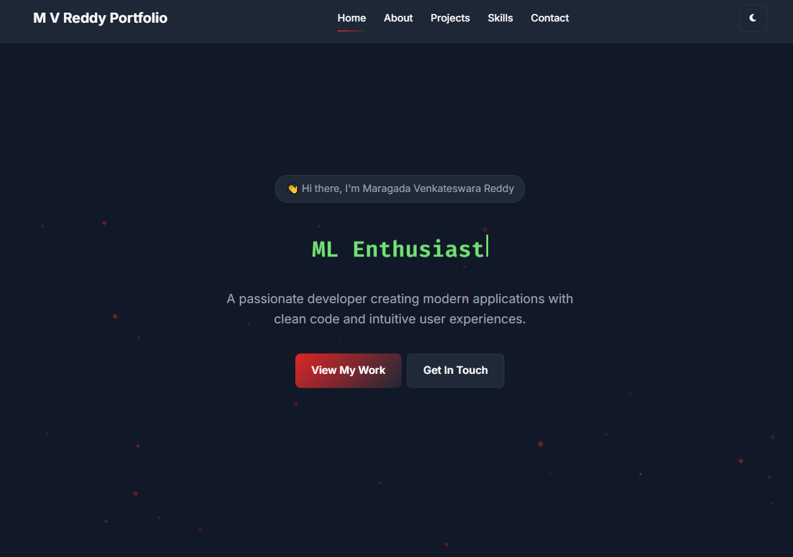

# Portfolio Website



A simple and responsive personal portfolio built using HTML, CSS and JavaScript.  
It showcases your projects, skills and contact details in a clean single-page layout.

---

## 🔗 Live Demo
Add your hosted link here:  
https://maragada-venkatesh-portfolio.vercel.app/

---

## 📂 Project Structure
Portfolio/
│── index.html # Main webpage
│── style.css # Styles and theme variables
│── script.js # Interactions, theme toggle, animations
│── images/ # Icons, thumbnails, screenshots
│── README.md


---

## ✨ Features

- Clean and responsive layout  
- Dark and light theme toggle  
- Project cards with links  
- Smooth scroll animations  
- Contact section with quick links  
- Mobile-friendly UI

---

## 🧰 Tech Used

- **HTML5**
- **CSS3**
- **JavaScript (Vanilla)**

---

## 🖥️ Run Locally

1. Clone the repository  
   ```bash
   git clone https://github.com/Venkatesh-6921/Portfolio.git

2. Open index.html in any browser. No server required.

---

##🚀 Deployment Options

You can deploy this portfolio on:

Vercel (recommended for GitHub integration)

Netlify

GitHub Pages

---

##📌 Suggestions for Future Improvements

Add SEO metadata for better search visibility

Optimize images for faster performance

Add detailed project pages or modals

Add analytics (privacy-friendly)

---


